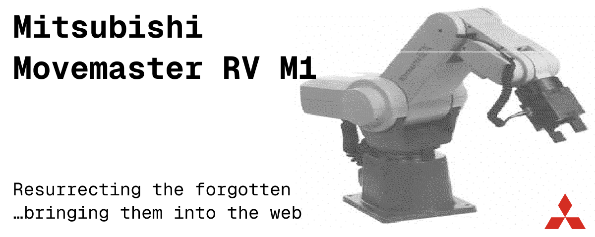

# Movemaster Robot Library

This project allows you to control a "vintage" Mitsubishi Movemaster EX Robot using Javascript via the serial RS232 port.

</img>



> This project relies heavily on the great work by Daniel Springwald – all documented [here](https://github.com/Springwald/Movemaster-RV-M1-Library).

## Installation

Install the library via npm:

```bash
npm install movemaster-robot
```

## Hardware Requirements

- Mitsubishi Movemaster EX RV-M1 robotic arm
- RS232 serial connection (USB-to-Serial adapter if needed)
- Computer with Node.js environment

## Quick Start

```javascript
import { Robot } from 'movemaster-robot';

const robot = new Robot();

async function main() {
  // Connect to the robot via serial port
  await robot.connect('/dev/ttyUSB0'); // Linux/Mac
  // await robot.connect('COM3'); // Windows
  
  // Initialize robot position
  await robot.nest();
  
  // Move to a specific position
  await robot.moveTo({
    x: 100,
    y: 50,
    z: 200,
    p: 0,
    r: 0
  });
  
  // Open gripper
  await robot.setGripper(true);
  
  // Close gripper
  await robot.setGripper(false);
  
  // Disconnect when done
  robot.disconnect();
}

main().catch(console.error);
```

## API Reference

### Connection Management

#### `connect(comPortName: string): Promise<void>`
Connects to the robot via the specified serial port.

```javascript
await robot.connect('/dev/ttyUSB0'); // Linux/Mac
await robot.connect('COM3'); // Windows
```

#### `isConnected(): boolean`
Returns whether the robot is currently connected.

#### `disconnect(): void`
Closes the serial port connection.

#### `listPorts(): Promise<string[]>`
Lists all available serial ports on the system.

```javascript
const ports = await robot.listPorts();
console.log('Available ports:', ports);
```

### Movement Commands

#### `moveTo(position: Position, interpolatePoints?: number): Promise<void>`
Moves the robot to an absolute position.

```javascript
await robot.moveTo({
  x: 100,    // X coordinate in mm
  y: 50,     // Y coordinate in mm  
  z: 200,    // Z coordinate in mm
  p: 0,      // Pitch angle in degrees
  r: 0       // Roll angle in degrees
}, 10); // Optional: number of interpolation points for smooth movement
```

#### `moveToXYZ(x: number, y: number, z: number, interpolatePoints?: number): Promise<void>`
Moves to specific XYZ coordinates while maintaining current P and R values.

```javascript
await robot.moveToXYZ(150, 75, 180);
```

#### `moveDelta(x: number, y: number, z: number, interpolatePoints?: number): Promise<void>`
#### `moveDelta(x: number, y: number, z: number, p: number, r: number, interpolatePoints?: number): Promise<void>`
Moves the robot relative to its current position.

```javascript
// Move relative in XYZ only
await robot.moveDelta(10, 0, -5);

// Move relative in all axes
await robot.moveDelta(10, 0, -5, 15, 0);
```

#### `rotateAxis(x: number, y: number, z: number, p: number, r: number): Promise<void>`
Rotates axes relative to the current position.

#### `movePath(points: Position[]): Promise<void>`
Moves the robot through a series of positions.

```javascript
const path = [
  { x: 100, y: 50, z: 200, p: 0, r: 0 },
  { x: 150, y: 75, z: 180, p: 10, r: 5 },
  { x: 200, y: 100, z: 160, p: 0, r: 0 }
];
await robot.movePath(path);
```

#### `moveToHomePosition(): Promise<void>`
Moves all axes to zero position.

#### `nest(): Promise<void>`
Moves the robot to its mechanical origin position. Must be performed immediately after power on.

### Gripper Control

#### `setGripper(open: boolean): Promise<void>`
Opens or closes the gripper.

```javascript
await robot.setGripper(true);  // Open gripper
await robot.setGripper(false); // Close gripper
```

#### `getGripperClosed(): boolean`
Returns whether the gripper is currently closed.

#### `setGripPressure(startingGripForce: number, retainedGrippingForce: number, startGrippingForceRetentionTime: number): Promise<void>`
Sets the gripper pressure parameters.

```javascript
await robot.setGripPressure(
  10,  // Starting grip force (0-15)
  5,   // Retained gripping force (0-15)  
  20   // Start gripping force retention time (0-99)
);
```

### Configuration

#### `setSpeed(speed: number): Promise<void>`
Sets the robot movement speed (0-9).

```javascript
await robot.setSpeed(5); // Medium speed
```

#### `setToolLength(length: number): Promise<void>`
Sets the tool length in mm.

```javascript
await robot.setToolLength(50); // 50mm tool
```

### Position and Status

#### `getActualPosition(forceUpdateByHardware?: boolean): Promise<Position>`
Gets the current robot position.

```javascript
const position = await robot.getActualPosition();
console.log('Current position:', position);
// { x: 100, y: 50, z: 200, p: 0, r: 0 }
```

#### `getPosition(): Position | null`
Returns the cached position without querying the hardware.

#### `getSpeed(): number`
Returns the current speed setting.

#### `getToolLength(): number`
Returns the current tool length setting.

### Error Handling

#### `checkRobotErrorCode(): Promise<{ok: true} | {ok: false, error: ROBOT_ERRORS}>`
Checks for robot errors.

```javascript
const result = await robot.checkRobotErrorCode();
if (!result.ok) {
  console.error('Robot error:', result.error);
}
```

#### `withCheck<T>(result: Promise<T>): Promise<T>`
Executes a command and automatically checks for errors.

```javascript
await robot.withCheck(robot.moveTo({ x: 100, y: 50, z: 200, p: 0, r: 0 }));
```

### System Commands

#### `reset(): Promise<void>`
Resets the robot control box.

## Types

### Position
```typescript
type Position = {
  x: number;  // X coordinate in mm
  y: number;  // Y coordinate in mm
  z: number;  // Z coordinate in mm
  p: number;  // Pitch angle in degrees
  r: number;  // Roll angle in degrees
};
```

### Robot Errors
```typescript
enum ROBOT_ERRORS {
  HARDWARE_ERROR = 1,
  COMMAND_ERROR = 2,
  UNKNOWN_ERROR = 99,
}
```

## Serial Port Configuration

The library uses the following default serial port settings:
- Baud Rate: 9600
- Data Bits: 7
- Stop Bits: 2
- Parity: Even
- RTS: true
- DTR: true
- Handshake: XOn/XOff

## Example: Complete Robot Operation

```javascript
import { Robot } from 'movemaster-robot';

async function robotDemo() {
  const robot = new Robot();
  
  try {
    // Connect to robot
    console.log('Connecting to robot...');
    await robot.connect('/dev/ttyUSB0');
    
    // Initialize robot
    console.log('Initializing robot...');
    await robot.nest();
    await robot.setSpeed(5);
    await robot.setToolLength(50);
    
    // Get current position
    const startPos = await robot.getActualPosition();
    console.log('Start position:', startPos);
    
    // Move to pickup position
    console.log('Moving to pickup position...');
    await robot.moveTo({ x: 150, y: 0, z: 100, p: 0, r: 0 });
    
    // Open gripper and move down
    await robot.setGripper(true);
    await robot.moveDelta(0, 0, -50);
    
    // Close gripper to pick up object
    await robot.setGripper(false);
    
    // Move up and to drop position
    await robot.moveDelta(0, 0, 50);
    await robot.moveTo({ x: -150, y: 0, z: 100, p: 0, r: 0 });
    
    // Drop object
    await robot.moveDelta(0, 0, -50);
    await robot.setGripper(true);
    await robot.moveDelta(0, 0, 50);
    
    // Return to home
    await robot.moveToHomePosition();
    
    console.log('Demo completed successfully!');
    
  } catch (error) {
    console.error('Robot operation failed:', error);
  } finally {
    robot.disconnect();
  }
}

robotDemo();
```

## Error Handling Best Practices

Always wrap robot operations in try-catch blocks and check for errors:

```javascript
try {
  await robot.moveTo({ x: 100, y: 50, z: 200, p: 0, r: 0 });
  
  const errorCheck = await robot.checkRobotErrorCode();
  if (!errorCheck.ok) {
    throw new Error(`Robot error: ${errorCheck.error}`);
  }
} catch (error) {
  console.error('Movement failed:', error);
  // Handle error appropriately
}
```

## Contributing

Contributions are welcome! Please feel free to submit a Pull Request.

## License

MIT
